# **ASP Assignment – Task B**
## Important: This assignment was done using Zig version 0.15.2

## **Build**

```bash
zig build
```

Executables produced:

* `zig-out/bin/task1a`
* `zig-out/bin/task1b`
* `zig-out/bin/task1c`
* `zig-out/bin/task2`
* `zig-out/bin/task2test`
* `zig-out/bin/task3`
* `zig-out/bin/task3test`

---

## **Run**

```
zig build run-task1a
zig build run-task1b
zig build run-task1c
zig build run-task2
zig build test-task2
zig build run-task3
zig build test-task3
```

It includes:
* Task 1a: Basic context capture + resume
* Task 1b: Simple fiber with custom stack
* Task 1c: Two fibers with stack alignment + red zone handling
* Task 2: Cooperative Fiber Runtime + test file
* Task 3: Cooperative Yielding between fibers + test file

---

## **Test**

Task 2 and 3 have test files:
* `task2/test.zig`, use `zig build test-task2` to run test
* `task3/test.zig`, use `zig build test-task3` to run test

---

## **Task 1**
### Task 1a
#### Expected output
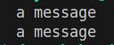
#### Explanation

- In task 1a, `get_context` saves the current CPU state, and `set_context` restores it. Both occur inside function `main`. 
- The control switch happens at this line:
`set_context(@ptrCast(&c));` 
- `set_context` makes the program resume as though `get_context` returned again, making it produce the output twice.

### Task 1b
#### Expected Output
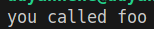
#### Explanation
Switch happens at `set_context(&c);` where it is set as \
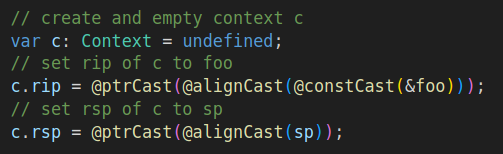 \
so control switches from `main -> foo`, this is the first actual fiber jump

### Task 1c
#### Expected Output
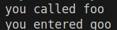
#### Explanation
The code in Task 1b might work, but it is just as likely to fail. For it to fully functional, we have to account for SysV ABI, in particular, the stack must be aligned to 16-bytes \
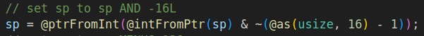 \
SyS V have specific rules about the stack when calling functions. A 128 byte space is stored beneath stack pointer called Red zone must be accounted \
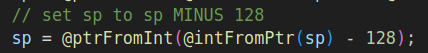 \
Two switches occur: \
Switch 1: `main -> foo` at `set_context(&c);` \
Switch 2: `foo -> goo` at `set_context(&c2);` \
So the full flow is `main -> foo -> goo` \
Some interesting variants of using `set/get_context` would be:
- `Ping-pong context switching`: Two fibers repeatedly transfer control back and forth by alternately saving their context and switching to the other fiber.
- `Round-robin scheduler`: Multiple fibers are executed in turn by saving their contexts on yield and resuming them in a cyclic order managed by a scheduler.
- `Bidirectional cooperative fibers`: Fibers explicitly save and restore their execution state using `get_context` and `set_context`, allowing them to yield and later resume execution cooperatively.

---

### Task 2
#### Expected Output
Running `main.zig` by `zig build run-task2` \
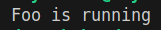 \
Running `test.zig` by `zig build test-task2` \
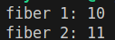

#### Explanation
Task 2 implements a lightweight cooperative fiber runtime in Zig. \
The runtime includes:
- A `fiber` type in `fiber.zig`
- A round-robin Scheduler in `schedule.zig`, support for:
    - `spawn()`
    - `do_it()`
    - `fiber_exit()`
    - `get_data()`
- Context switching using the provided low-level assembly library `libcontext.a`
- Sys V ABI-compliant stack alignment and red-zone handling
- Passing data between fibers
1. **Fiber Implementation** \
Fiber Class UML: \
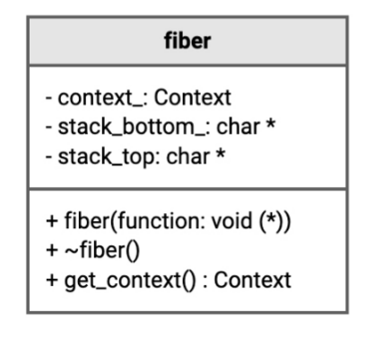 \
In this design, a fiber is defined by:
- Its own stack
- A context struct (`rip`, `rsp`, and other registers)
- A pointer to optional data \
- Each fiber:
    1. Allocates a private 4096-byte stack
    2. Aligns the top of stack to 16 bytes (Sys V ABI)
    3. Reserves 128 bytes red zone under the stack pointer
    4. Initializes the context so that `rip = func` and `rsp = aligned stack pointer` \
- Stack setup summary: \
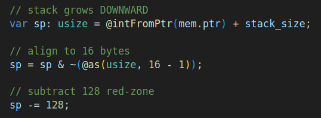

- Without these 2 adjustments, control transfer using `set_context` would crash unpredictably

2. **Scheduler Design** \
Scheduler visualized: \
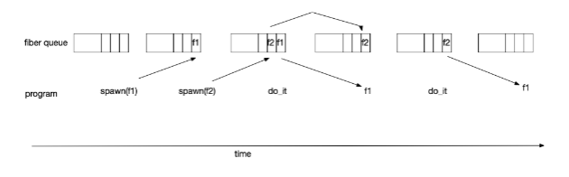 \
Scheduler UML: \
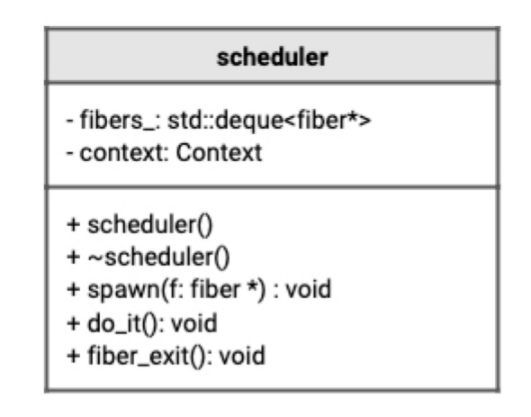
The scheduler:
- Manages a queue of pending fibers
- Tracks the currently running fiber
- Uses `get_context` and `set_context` to switch between scheduler and fibers
- Runs each fiber exactly once
- Round-robin scheduling. Fibers must run in the order they are spawned, so a `FIFO` structure is required. \
`fibers_: std.ArrayListUnmanaged(*Fiber)` is used, supports `append()` and `orderedRemoved(0)`.

3. **Reasons to make `s` global**
- Fibers run on a separate stack
    - A fiber can't return to a caller through normal function return semantics. When a fiber is running, we have no call chain connecting it to `main()`.
    - So if a fiber needs to call `fiber_exit()` or `get_data()`,  it can't receive a scheduler reference through arguments or return values
- `set_context` jumps erase the call stack
    - It completely replaces the current execution context. All normal caller/callee relationships vanish so a fiber can't "remember" who invoked it
- Conclusion: `s` is made global so fibers have a way to access the scheduler after control flow has jumped using `set_context`, which breaks normal function call structure.

4. **Example: Passing data between fibers** \
Running `test.zig` by `zig build test-task2` demonstrates shared state mutation: \
Expected Output \
 \
Fiber 1 increments shared data (`dp.* += 1`) before exiting. \
Fiber 2 observes the updated value. \
The implementation is accomplished using \
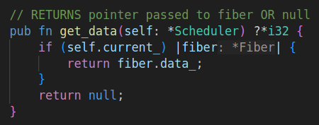 


5. **Notes**
- Implementing stacked-based coroutines requires manual context management
- Context switching breaks normal call stack assumptions
- SysV ABI rules for stack alignment and red zone are non-optional
- Global scheduler access is mandatory for fibers
- Cooperative scheduling makes concurrency predictable and deterministic

---

### Task 3
#### Expected Output
Running `main.zig` by `zig build run-task3` \
 \
Running `test.zig` by `zig build test-task3` \
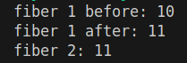

#### Explanation
Task 3 adds the ability for a running fiber to **voluntarily suspend its execution** and return control to the scheduler before completion. This enables:

- Interleaved execution of fibers within a single thread  
- Cooperative multitasking without preemption  
- Fine-grained control over scheduling points inside fiber code  

This behavior is implemented through a new `yield()` function, which: \
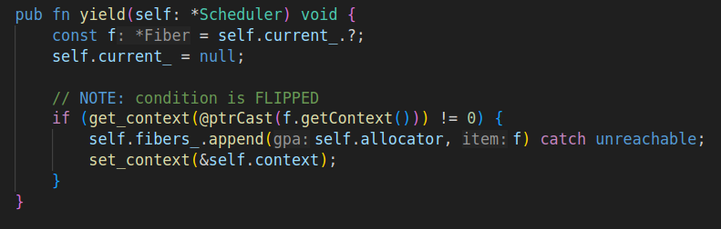 
1. Saves the current fiber’s execution context using `get_context`
2. Re-enqueues the fiber at the back of the scheduler’s queue
3. Restores the scheduler’s context using `set_context` 
 \
When the yielding fiber is scheduled again, execution resumes **immediately after the call to `yield()`**, preserving its stack and register state. \
Task 3 therefore transforms the scheduler from a **run-to-completion model** into a **fully cooperative fiber runtime**, closer to how coroutines and async/await systems behave internally.